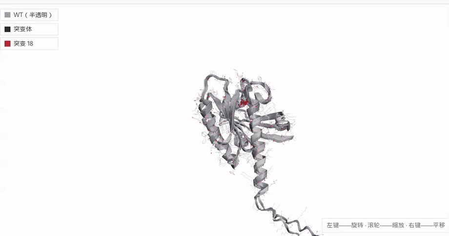

# ProteinGPU-Studio

[English](README.md) | **Русский** | [中文](README_ZH.md)

<div align="center">

**Предиктивный мутагенез на реальных folding-моделях — с честным бенчмарком CPU vs GPU.**

Вводишь белок, мутируешь один остаток, смотришь, как WT и мутант сворачиваются —
и видишь точно, сколько это стоило на CPU и на GPU. Без прикрас.




</div>

## Что это

Веб-платформа, которая мутирует последовательность белка, сворачивает WT и мутант
реальной structure-prediction моделью (OmegaFold; ESMFold в качестве fallback),
накладывает структуры друг на друга и показывает, насколько мутация реально
изменила укладку — глобальный/локальный RMSD через Kabsch-выравнивание, TM-score,
pLDDT по каждой цепи. Инференс-стек (CPU / fp32-GPU / fp16-GPU) бенчмаркается на
60-ваттной ноутбучной GPU с честной статистикой (median + IQR), а ядро выравнивания
существует в трёх реализациях (NumPy, C++17 OpenMP, CUDA) — чтобы было видно,
куда уходит время.

Помимо картины одного мутанта, **ручка силы мутагенеза** порождает ансамбли
вариантов вокруг одной позиции и измеряет чувствительность позиции
**распределением структурных откликов** — статистиками и гистограммами,
а не сравнением двух картинок на глаз.

Всё на экране настоящее: никаких фейковых прогресс-баров и никаких dummy-моделей —
UI показывает реальные стадии пайплайна бэкенда, а демо выше — полный живой прогон.

## Возможности

- **Реальные folding-модели** — OmegaFold primary, ESMFold fallback; профили CPU / fp32-GPU / fp16-GPU переключаются в UI
- **Анализ WT vs MUT** — RMSD с Kabsch-выравниванием (глобальный + локальное окно), TM-score, pLDDT WT/mut/Δ, вердикт по выравниванию
- **HPC-ядро на C++17 / CUDA** — батчевое ядро Kabsch + RMSD за PyBind11, пути с PCIe-копиями и device-resident замеряются раздельно
- **Сатурационный скан** — все 19 замен в одной позиции, ранжированная таблица + график
- **Ручка силы мутагенеза** — ансамбли из K вариантов вокруг одной якорной позиции: μ одновременных замен на вариант (якорь + фоновые сайты), каждая замена выбирается по **матрице Грэнтэма** с температурой τ (консервативные ↔ радикальные). Чувствительность = **распределение откликов** по ансамблю: медиана + IQR, гистограммы local RMSD и ΔpLDDT окна, бейджи уровня/разброса — без выдуманного счёта 0–100. Exhaustive-режим («все 19 замен») воспроизводит сатурационный скан в точности — те же цели, те же артефакты
- **Браузер белка** — 2D-обозреватель с треками вдоль последовательности: pLDDT по остаткам, мутация, результаты скана и хит-стрип чувствительности ансамбля (средний |ΔpLDDT| по остатку); режим окна ±50, мини-карта, тултипы по остаткам
- **Послойный график pLDDT** — WT против мутанта, с ховером
- **Сравнение прогонов** — две таблицы поверх истории задач по одному белку: мутации ранжируются по local RMSD; позиции сравниваются перцентилями внутри сравниваемого набора — у каждого окна свой уровень шума модели
- **Научные пресеты** — KRAS G12D, p53 R82H, HbB E6V, лизоцим I56T, Trp-cage W6F, Aβ42 E22G, α-синуклеин A53T, GFP S65T
- **Ввод DNA FASTA** — загружаешь ген, получаешь окно трансляции кодон→аминокислота
- **Честный пайплайн задач** — поэтапный прогресс из реального бэкенда (включая «ожидание GPU-слота»), история задач в SQLite
- **Интерфейс RU / EN / 中文** — переключатель покрывает и тексты, генерируемые бэкендом (сводки, пресеты, стадии)

## Бенчмарки

Измерено на машине, на которой писался проект: **RTX 3050 Laptop 6 GB с лимитом
60 Вт**, torch 2.6.0+cu124. Все числа — **median + IQR** по повторам, 2 прогревочных
запуска отбрасываются: 60-ваттный ноутбук троттлит, единичный замер врёт.

Инференс OmegaFold, последовательность 76 остатков (KRAS):

| Профиль | Wall time (median) | Пик VRAM |
|---|---|---|
| CPU | 143.5 с | — |
| fp32-GPU | 11.6 с | 3.27 GB |
| fp16-GPU | **8.7 с** (16× против CPU) | 4.86 GB |

Обрати внимание на trade-off, который делает видимой таблица: fp16 быстрее,
но *прожорливее* по видеопамяти.

Ядро Kabsch RMSD, 1024 пары структур × 256 атомов:

| Движок | Wall time (median) |
|---|---|
| NumPy | 31.8 мс |
| C++17 OpenMP | **0.36 мс** (88× против NumPy) |
| CUDA (копии через PCIe) | 3.2 мс |
| CUDA (device-resident) | 1.8 мс |

CUDA-ядро выигрывает только тогда, когда данные живут на устройстве, — переход
через PCIe стоит дороже самого ядра. Воспроизведение: `python scripts/10_bench_inference.py`,
`python scripts/11_bench_kernels.py`.

## Быстрый старт

```bash
./scripts/00_setup_env.sh             # venv + зависимости
source .venv/bin/activate
make -C hpc_core cpu                  # C++-ядро (CUDA опционально: make cuda)

uvicorn backend.app.main:app --port 8077
cd frontend && npm install && npm run dev
```

Открой фронтенд, выбери пресет или вставь FASTA, запусти WT + мутант, сатурационный
скан или ансамбль с ручки.
Полная проверка пайплайна: `python scripts/e2e_smoke.py` (убиквитин + I44A/I3L/P19G).

## Архитектура

```
[Web Client: React / 3Dmol.js / Plotly]
                 │ REST (polling)
                 ▼
[Backend Gateway: FastAPI]
        │                    │
        ▼                    ▼
[ML Inference Engine]   [C++/CUDA HPC Core]
(OmegaFold / PyTorch)   (Kabsch / RMSD, PyBind11)
```

- `backend/` — FastAPI: очередь задач (SQLite), валидация, телеметрия
- `ml/` — обёртки folding-моделей + профили CPU/GPU-fp32/fp16
- `hpc_core/` — C++17 + CUDA ядро: Kabsch, RMSD, PyBind11-биндинги
- `frontend/` — Vite + React + TypeScript, 3Dmol.js + Plotly.js
- `scripts/` — установка окружения, spike-тесты, бенчмарки, генераторы отчётных графиков и презентации, запись демо

Демо-GIF записывается Playwright-скриптом, который прогоняет реальный UI целиком
на реальном GPU (`scripts/20_demo_video.py`) — включая проверку, что записанная
задача выполнилась на настоящей модели, а не на заглушке.

## Благодарности

- [OmegaFold](https://github.com/HeliXonProtein/OmegaFold) ([Wu et al., 2022](https://doi.org/10.1101/2022.07.21.500999), Apache-2.0) и [ESMFold](https://github.com/facebookresearch/esm) — предсказание структуры
- [3Dmol.js](https://3dmol.csb.pitt.edu/) — молекулярный вьюер · [Plotly.js](https://plotly.com/javascript/) — графики
- [PyBind11](https://github.com/pybind/pybind11) — биндинги C++/Python